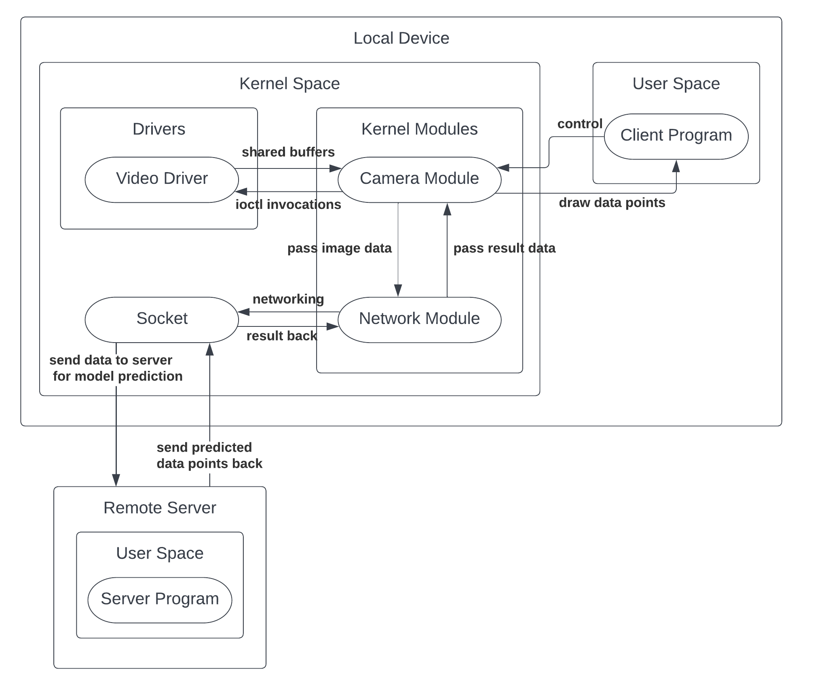

# MoveNet

The goal is improving performance and efficiency of ML (facial-recognition) workload on resource-limited environment by offloading resource-intensive work to the cloud and moving as many components as possible to the kernel space.

## Structure Diagram

The diagram above roughly covers the interactions between different modules. However, it didn't reveal the whole picture. There are still some nitty-gritty details under the hood.

